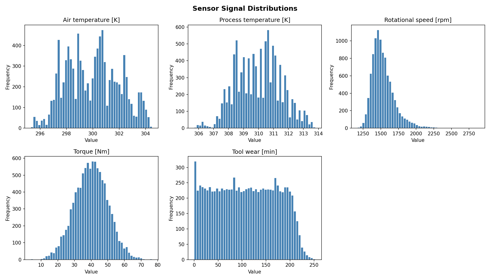
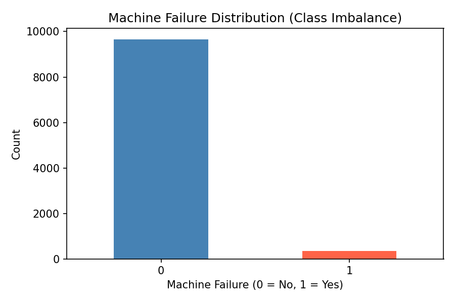
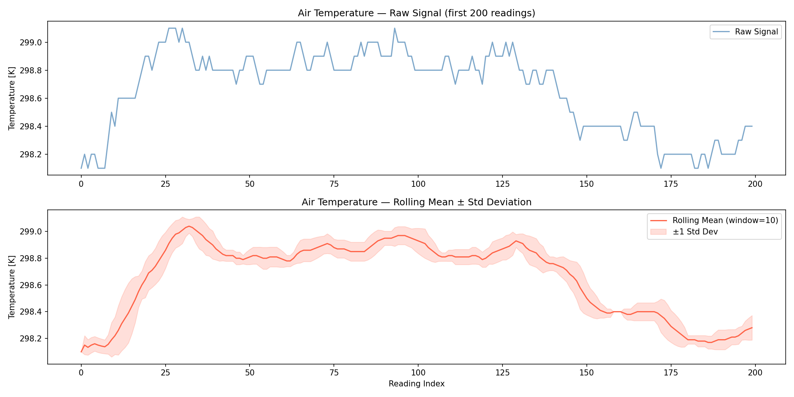

# Week 1 Data Ingestion and Signal Processing Report

## Project Title

Contextual Predictive Maintenance Using IoT Edge AI

## Objective

The objective of Week 1 was to establish a robust data ingestion pipeline, understand the structure and quality of the predictive maintenance dataset, and perform initial signal processing to prepare the data for future machine learning tasks.

This phase focused on collecting, validating, and analyzing machine telemetry data to identify trends, distributions, and potential challenges that may affect model performance in later stages of the project.

---

# Dataset Overview

The project utilizes the AI4I Predictive Maintenance Dataset, which contains telemetry measurements collected from industrial machines operating under varying conditions.

### Key Features

| Feature                 | Description                          |
| ----------------------- | ------------------------------------ |
| Air Temperature [K]     | Ambient operating temperature        |
| Process Temperature [K] | Internal machine process temperature |
| Rotational Speed [rpm]  | Machine rotational speed             |
| Torque [Nm]             | Applied rotational force             |
| Tool Wear [min]         | Tool usage duration                  |
| Machine Failure         | Failure indicator                    |
| TWF                     | Tool Wear Failure                    |
| HDF                     | Heat Dissipation Failure             |
| PWF                     | Power Failure                        |
| OSF                     | Overstrain Failure                   |
| RNF                     | Random Failure                       |

---

# Data Ingestion Process

The following activities were performed during the data ingestion phase:

### Dataset Loading

* Successfully imported the AI4I Predictive Maintenance Dataset using Pandas.
* Verified file accessibility and data integrity.

### Data Structure Inspection

* Examined dataset dimensions.
* Inspected feature names and data types.
* Reviewed initial records to understand data organization.

### Data Quality Validation

* Checked for missing values across all columns.
* Verified duplicate records.
* Generated descriptive statistical summaries.

### Processed Dataset Creation

* Created a processed version of the dataset for downstream analysis and feature engineering tasks.

---

# Exploratory Signal Analysis

To understand machine behavior and sensor patterns, multiple exploratory analyses were conducted.

---

## Sensor Distribution Analysis

Histograms were generated for major telemetry variables:

* Air Temperature
* Process Temperature
* Rotational Speed
* Torque
* Tool Wear

### Visualization

### Observations

#### Air Temperature

* Values are concentrated within a relatively narrow operating range.
* Distribution appears approximately normal.
* No significant anomalies were observed.

#### Process Temperature

* Similar distribution to air temperature.
* Indicates stable process conditions across observations.

#### Rotational Speed

* Displays moderate variability.
* Presence of high-speed operating instances suggests different machine operating states.

#### Torque

* Distributed around a central operating range.
* Useful indicator of machine load and stress.

#### Tool Wear

* Broad distribution across observations.
* Expected to contribute significantly to failure prediction.

---

## Class Imbalance Analysis

Machine failure occurrences were analyzed to understand target distribution.

### Visualization

### Observations

* The dataset is highly imbalanced.
* Non-failure observations significantly outnumber failure cases.
* Failure events represent only a small fraction of the dataset.

### Implications

Class imbalance can negatively impact machine learning models by biasing predictions toward the majority class.

Future phases will address this challenge using:

* Stratified Cross Validation
* SMOTE (Synthetic Minority Oversampling Technique)
* Precision-Recall based evaluation metrics

---

## Rolling Feature and Signal Trend Analysis

Rolling statistics were applied to machine telemetry signals to capture temporal trends and variability.

### Features Generated

* Rolling Mean
* Rolling Standard Deviation

### Visualization

### Observations

* Sensor signals demonstrate relatively stable behavior over time.
* Rolling means effectively capture long-term operational trends.
* Standard deviation bands highlight variability within operating conditions.
* No major abrupt shifts or extreme anomalies were observed in the analyzed window.

### Importance

Rolling statistical features are widely used in predictive maintenance systems because they help detect:

* Sensor drift
* Equipment degradation
* Emerging anomalies
* Abnormal operational patterns

These features will be valuable during future feature engineering and model development phases.

---

# Challenges Identified

### Class Imbalance

Machine failures occur infrequently, creating a highly imbalanced target distribution.

### Feature Engineering Requirements

Raw telemetry data alone may not sufficiently capture failure behavior. Additional engineered features will be required.

### Temporal Dependencies

Machine behavior changes over time, requiring signal-based feature extraction techniques.

---

# Deliverables Completed

* Data ingestion pipeline
* Dataset validation
* Missing value analysis
* Duplicate record analysis
* Statistical summary generation
* Sensor distribution visualizations
* Class imbalance analysis
* Rolling feature generation
* Signal trend visualization
* Processed dataset creation

---

# Conclusion

Week 1 successfully established the foundation for the Predictive Maintenance project. The AI4I dataset was ingested, validated, and analyzed through multiple exploratory techniques. Initial signal processing and rolling feature generation provided valuable insights into machine behavior and operational trends.

The generated findings will support future stages involving contextual data fusion, feature engineering, imbalanced classification, and predictive maintenance model development.

---

# Next Steps (Week 2)

* Advanced Feature Engineering
* Contextual Data Fusion
* Correlation Analysis
* Feature Importance Exploration
* Data Preparation for Machine Learning Models
* Experimental Pipeline Development

---

**Author:** Preeti Auditto
**Internship:** Infotact Data Science & Machine Learning Internship
**Project:** Contextual Predictive Maintenance Using IoT Edge AI
